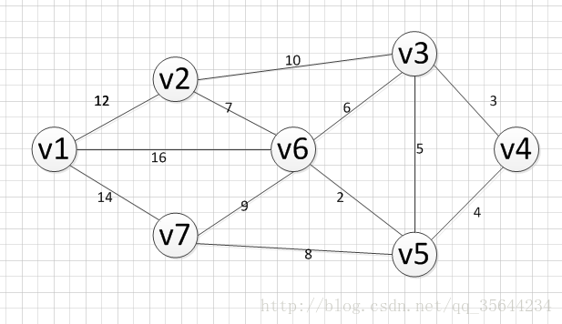
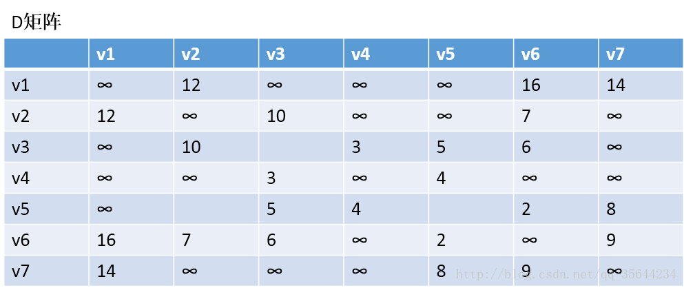
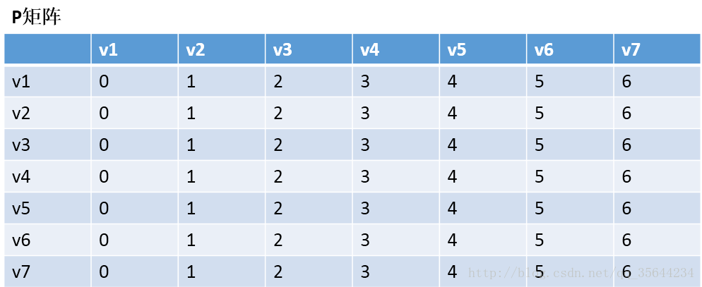
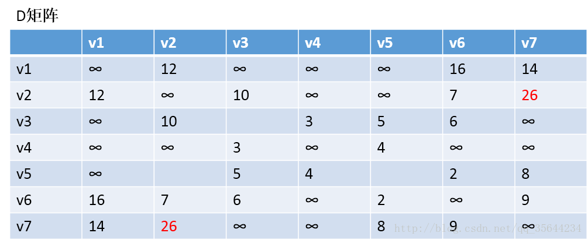
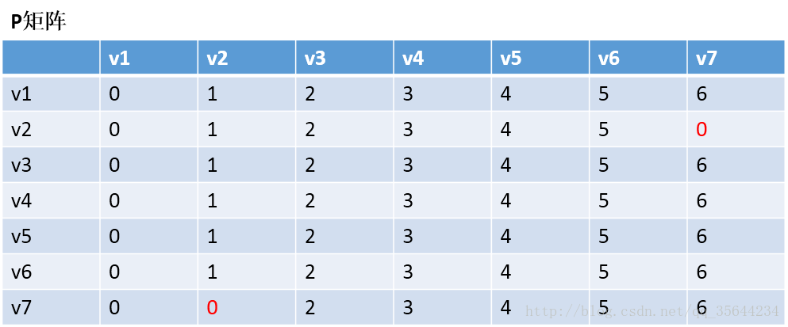
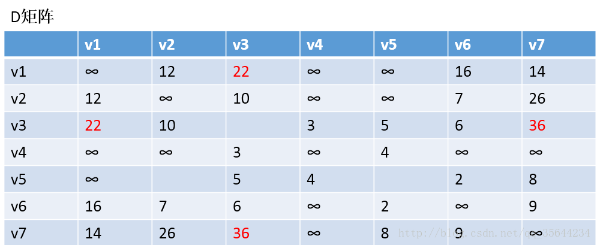
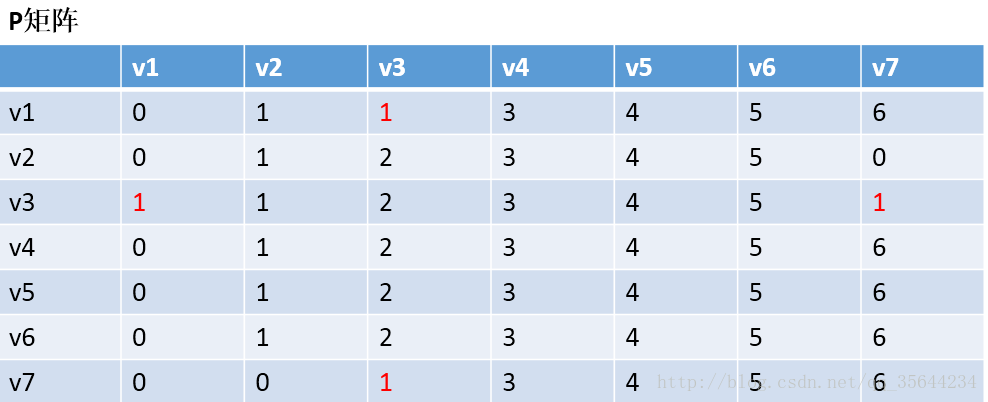

Floyd算法的介绍
算法的特点：
弗洛伊德算法是解决任意两点间的最短路径的一种算法，可以正确处理有向图或有向图或负权（但不可存在负权回路)的最短路径问题，同时也被用于计算有向图的传递闭包。

算法的思路

通过Floyd计算图G=(V,E)中各个顶点的最短路径时，需要引入两个矩阵，矩阵S中的元素a[i][j]表示顶点i(第i个顶点)到顶点j(第j个顶点)的距离。矩阵P中的元素b[i][j]，表示顶点i到顶点j经过了b[i][j]记录的值所表示的顶点。

假设图G中顶点个数为N，则需要对矩阵D和矩阵P进行N次更新。初始时，矩阵D中顶点a[i][j]的距离为顶点i到顶点j的权值；如果i和j不相邻，则a[i][j]=∞，矩阵P的值为顶点b[i][j]的j的值。 接下来开始，对矩阵D进行N次更新。第1次更新时，如果”a[i][j]的距离” > “a[i][0]+a[0][j]”(a[i][0]+a[0][j]表示”i与j之间经过第1个顶点的距离”)，则更新a[i][j]为”a[i][0]+a[0][j]”,更新b[i][j]=b[i][0]。 同理，第k次更新时，如果”a[i][j]的距离” > “a[i][k-1]+a[k-1][j]”，则更新a[i][j]为”a[i][k-1]+a[k-1][j]”,b[i][j]=b[i][k-1]。更新N次之后，操作完成！

3、Floyd算法的实例过程
上面，我们已经介绍了算法的思路，如果，你觉得还是不理解，那么通过一个实际的例子，把算法的过程过一遍，你就明白了，如下图，我们求下图的每个点对之间的最短路径的过程如下：

第一步，我们先初始化两个矩阵，得到下图两个矩阵：

、

第二步，以v1为中阶，更新两个矩阵：
发现，a[1][0]+a[0][6] < a[1][6] 和a[6][0]+a[0][1] < a[6][1]，所以我们只需要矩阵D和矩阵P，结果如下：

通过矩阵P，我发现v2–v7的最短路径是：v2–v1–v7

第三步：以v2作为中介，来更新我们的两个矩阵，使用同样的原理，扫描整个矩阵，得到如下图的结果：

OK，到这里我们也就应该明白Floyd算法是如何工作的了，他每次都会选择一个中介点，然后，遍历整个矩阵，查找需要更新的值，下面还剩下五步，就不继续演示下去了，理解了方法，我们就可以写代码了。

