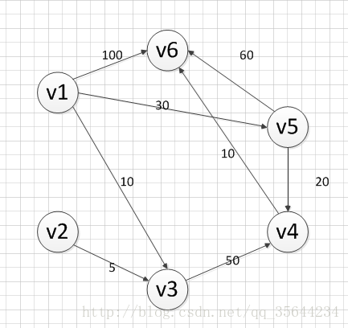

SPFA算法介绍
SPFA算法是求解单源最短路径问题的一种算法，由理查德·贝尔曼（Richard Bellman） 和 莱斯特·福特 创立的。有时候这种算法也被称为 Moore-Bellman-Ford 算法，因为 Edward F. Moore 也为这个算法的发展做出了贡献。它的原理是对图进行V-1次松弛操作，得到所有可能的最短路径。其优于迪科斯彻算法的方面是边的权值可以为负数、实现简单，缺点是时间复杂度过高，高达 O(VE)。但算法可以进行若干种优化，提高了效率。

算法的思路：
我们用数组dis记录每个结点的最短路径估计值，用邻接表或邻接矩阵来存储图G。我们采取的方法是动态逼近法：设立一个先进先出的队列用来保存待优化的结点，优化时每次取出队首结点u，并且用u点当前的最短路径估计值对离开u点所指向的结点v进行松弛操作，如果v点的最短路径估计值有所调整，且v点不在当前的队列中，就将v点放入队尾。这样不断从队列中取出结点来进行松弛操作，直至队列空为止

我们要知道带有负环的图是没有最短路径的，所以我们在执行算法的时候，要判断图是否带有负环，方法有两种：

开始算法前，调用拓扑排序进行判断（一般不采用，浪费时间）
如果某个点进入队列的次数超过N次则存在负环（N为图的顶点数）
3、SPFA算法手动操作过程
下面我们采用SPFA算法对下图求v1到各个顶点的最短路径，通过手动的方式来模拟SPFA每个步骤的过程

初始化：
首先我们先初始化数组dis如下图所示：（除了起点赋值为0外，其他顶点的对应的dis的值都赋予无穷大，这样有利于后续的松弛）

此时，我们还要把v1如队列：{v1}

现在进入循环，直到队列为空才退出循环。

第一次循环：
首先，队首元素出队列，即是v1出队列，然后，对以v1为弧尾的边对应的弧头顶点进行松弛操作，可以发现v1到v3，v5，v6三个顶点的最短路径变短了，更新dis数组的值，得到如下结果：

我们发现v3，v5，v6都被松弛了，而且不在队列中，所以要他们都加入到队列中：{v3，v5，v6}

第二次循环
此时，队首元素为v3，v3出队列，然后，对以v3为弧尾的边对应的弧头顶点进行松弛操作，可以发现v1到v4的边，经过v3松弛变短了，所以更新dis数组，得到如下结果：

此时只有v4对应的值被更新了，而且v4不在队列中，则把它加入到队列中：{v5,v6,v4}

第三次循环
此时，队首元素为v5，v5出队列，然后，对以v5为弧尾的边对应的弧头顶点进行松弛操作，发现v1到v4和v6的最短路径，经过v5的松弛都变短了，更新dis的数组，得到如下结果：

我们发现v4、v6对应的值都被更新了，但是他们都在队列中了，所以不用对队列做任何操作。队列值为：{v6，v4}

第四次循环
此时，队首元素为v6，v6出队列，然后，对以v6为弧尾的边对应的弧头顶点进行松弛操作，发现v6出度为0，所以我们不用对dis数组做任何操作，其结果和上图一样，队列同样不用做任何操作，它的值为：{v4}

第五次循环
此时，队首元素为v4，v4出队列，然后，对以v4为弧尾的边对应的弧头顶点进行松弛操作，可以发现v1到v6的最短路径，经过v4松弛变短了，所以更新dis数组，得到如下结果：

因为我修改了v6对应的值，而且v6也不在队列中，所以我们把v6加入队列，{v6}

第六次循环
此时，队首元素为v6，v6出队列，然后，对以v6为弧尾的边对应的弧头顶点进行松弛操作，发现v6出度为0，所以我们不用对dis数组做任何操作，其结果和上图一样，队列同样不用做任何操作。所以此时队列为空。
OK，队列循环结果，此时我们也得到了v1到各个顶点的最短路径的值了，它就是dis数组各个顶点对应的值，如下图：

4、SPFA算法的代码实现
核心代码：

bool Graph::SPFA(int begin) {
    bool  *visit;
    //visit用于记录是否在队列中
    visit = new bool[this->vexnum];
    int *input_queue_time;
    //input_queue_time用于记录某个顶点入队列的次数
    //如果某个入队列的次数大于顶点数vexnum，那么说明这个图有环，
    //没有最短路径，可以退出了
    input_queue_time = new int[this->vexnum];
    queue<int> s;  //队列，用于记录最短路径被改变的点

    /*
    各种变量的初始化
    */
    int i;
    for (i = 0; i < this->vexnum; i++) {
        visit[i] = false;
        input_queue_time[i] = 0;
        //路径开始都初始化为直接路径,长度都设置为无穷大
        dis[i].path = this->node[begin-1].data + "-->" + this->node[i].data;
        dis[i].weight = INT_MAX;
    }
    //首先是起点入队列，我们记住那个起点代表的是顶点编号，从1开始的
    s.push(begin - 1); 
    visit[begin - 1] = true; 
    ++input_queue_time[begin-1];
    //
    dis[begin - 1].path =this->node[begin - 1].data;
    dis[begin - 1].weight = 0;

    int temp;
    int res;
    ArcNode *temp_node;
    //进入队列的循环
    while (!s.empty()) {
        //取出队首的元素，并且把队首元素出队列
        temp = s.front(); s.pop();
        //必须要保证第一个结点不为空
        if (node[temp].firstarc)
        {
            temp_node = node[temp].firstarc;
            while (temp_node) {
                //如果边<temp,temp_node>的权重加上temp这个点的最短路径
                //小于之前temp_node的最短路径的长度，则更新
                //temp_node的最短路径的信息
                if (dis[temp_node->adjvex].weight > (temp_node->weight + dis[temp].weight)) {
                    //更新dis数组的信息
                    dis[temp_node->adjvex].weight = temp_node->weight + dis[temp].weight;
                    dis[temp_node->adjvex].path = dis[temp].path + "-->" + node[temp_node->adjvex].data;
                    //如果还没在队列中，加入队列，修改对应的信息
                    if (!visit[temp_node->adjvex]) {
                        visit[temp_node->adjvex] = true;
                        ++input_queue_time[temp_node->adjvex];
                        s.push(temp_node->adjvex);
                        if (input_queue_time[temp_node->adjvex] > this->vexnum) {
                            cout << "图中有环" << endl;
                            return false;
                        }
                    }
                }
                temp_node = temp_node->next;
            }
        }   
    }

    //打印最短路径

    return true;
}

