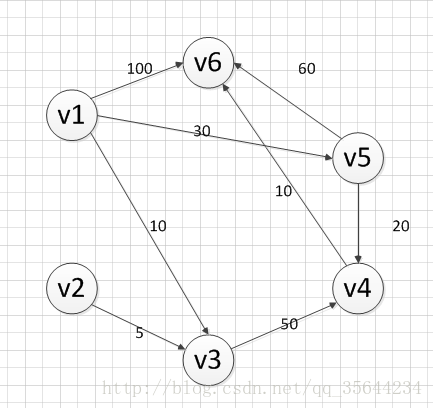
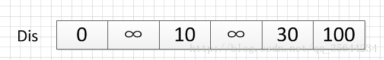
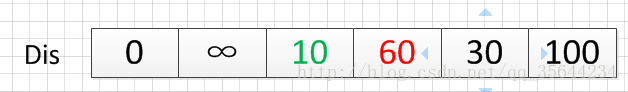
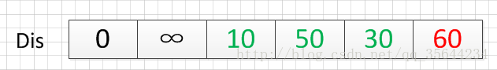
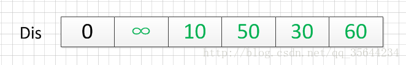

1、最短路径问题介绍

问题解释：
从图中的某个顶点出发到达另外一个顶点的所经过的边的权重和最小的一条路径，称为最短路径

解决问题的算法：

迪杰斯特拉算法（Dijkstra算法）
弗洛伊德算法（Floyd算法）
SPFA算法
这篇博客，我们就对Dijkstra算法来做一个详细的介绍

2、Dijkstra算法介绍
算法特点：

迪科斯彻算法使用了广度优先搜索解决赋权有向图或者无向图的单源最短路径问题，算法最终得到一个最短路径树。
该算法常用于路由算法或者作为其他图算法的一个子模块。

算法的思路

Dijkstra算法采用的是一种贪心的策略，声明一个数组dis来保存源点到各个顶点的最短距离和一个保存已经找到了最短路径的顶点的集合：T，
初始时，原点 s 的路径权重被赋为 0 （dis[s] = 0）。若对于顶点 s 存在能直接到达的边（s,m），则把dis[m]设为w（s, m）,
同时把所有其他（s不能直接到达的）顶点的路径长度设为无穷大。初始时，集合T只有顶点s。
然后，从dis数组选择最小值，则该值就是源点s到该值对应的顶点的最短路径，并且把该点加入到T中，OK，此时完成一个顶点，
然后，我们需要看看新加入的顶点是否可以到达其他顶点并且看看通过该顶点到达其他点的路径长度是否比源点直接到达短，如果是，
那么就替换这些顶点在dis中的值。
然后，又从dis中找出最小值，重复上述动作，直到T中包含了图的所有顶点。

3、Dijkstra算法示例演示
下面我求下图，从顶点v1到其他各个顶点的最短路径

首先第一步，我们先声明一个dis数组，该数组初始化的值为：

我们的顶点集T的初始化为：T={v1}

既然是求 v1顶点到其余各个顶点的最短路程，那就先找一个离 1 号顶点最近的顶点。通过数组 dis 可知当前离v1顶点最近是 v3顶点。
当选择了 2 号顶点后，dis[2]（下标从0开始）的值就已经从“估计值”变为了“确定值”，即 v1顶点到 v3顶点的最短路程就是当前 dis[2]值。
将V3加入到T中。为什么呢？因为目前离 v1顶点最近的是 v3顶点，并且这个图所有的边都是正数，那么肯定不可能通过第三个顶点中转，
使得 v1顶点到 v3顶点的路程进一步缩短了。因为 v1顶点到其它顶点的路程肯定没有 v1到 v3顶点短.

OK，既然确定了一个顶点的最短路径，下面我们就要根据这个新入的顶点V3会有出度，发现以v3 为弧尾的有： < v3,v4 >,那么我们看看路径：
v1–v3–v4的长度是否比v1–v4短，其实这个已经是很明显的了，因为dis[3]代表的就是v1–v4的长度为无穷大，而v1–v3–v4的长度为：10+50=60，
所以更新dis[3]的值,得到如下结果：

因此 dis[3]要更新为 60。这个过程有个专业术语叫做“松弛”。即 v1顶点到 v4顶点的路程即 dis[3]，通过 < v3,v4> 这条边松弛成功。
这便是 Dijkstra 算法的主要思想：通过“边”来松弛v1顶点到其余各个顶点的路程。

然后，我们又从除dis[2]和dis[0]外的其他值中寻找最小值，发现dis[4]的值最小，通过之前是解释的原理，可以知道v1到v5的最短距离就是dis[4]的值，
然后，我们把v5加入到集合T中，然后，考虑v5的出度是否会影响我们的数组dis的值，v5有两条出度：< v5,v4>和 < v5,v6>,然后我们发现：
v1–v5–v4的长度为：50，而dis[3]的值为60，所以我们要更新dis[3]的值.另外，v1-v5-v6的长度为：90，而dis[5]为100，
所以我们需要更新dis[5]的值。更新后的dis数组如下图：

然后，继续从dis中选择未确定的顶点的值中选择一个最小的值，发现dis[3]的值是最小的，所以把v4加入到集合T中，此时集合T={v1,v3,v5,v4},
然后，考虑v4的出度是否会影响我们的数组dis的值，v4有一条出度：< v4,v6>,然后我们发现：v1–v5–v4–v6的长度为：60，而dis[5]的值为90，
所以我们要更新dis[5]的值，更新后的dis数组如下图：

然后，我们使用同样原理，分别确定了v6和v2的最短路径，最后dis的数组的值如下：

因此，从图中，我们可以发现v1-v2的值为：∞，代表没有路径从v1到达v2。所以我们得到的最后的结果为：

起点  终点    最短路径    长度  
v1    v2     无          ∞  
      v3     {v1,v3}    10  
      v4     {v1,v5,v4}  50  
      v5     {v1,v5}    30  
      v6     {v1，v5,v4,v6} 60  
————————————————

